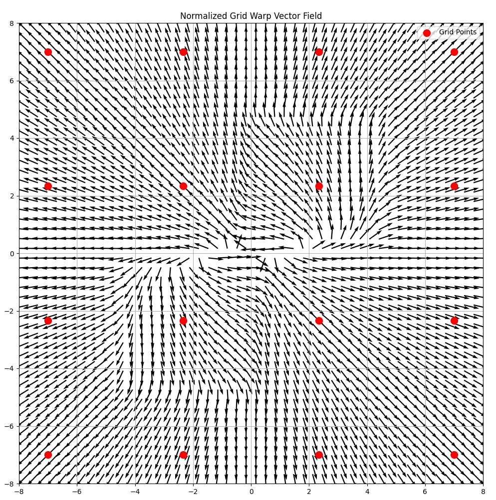

# 2D Dynamic Fusion

## Data setup

Preprocessed data is under `/robot`.

## Warp Visualization.

To fit a 2D warp field to a non-linear transformation and visualize it run `python dynamic_fusion_2d.py --warp`.

## 2D Dynamic Fusion

In the 2D dynamic fusion scenario, sensor scans of a 2D robot are transformed into the canonical pose. The following is the command to run it: `python dynamic_fusion_2d.py --robot`.

