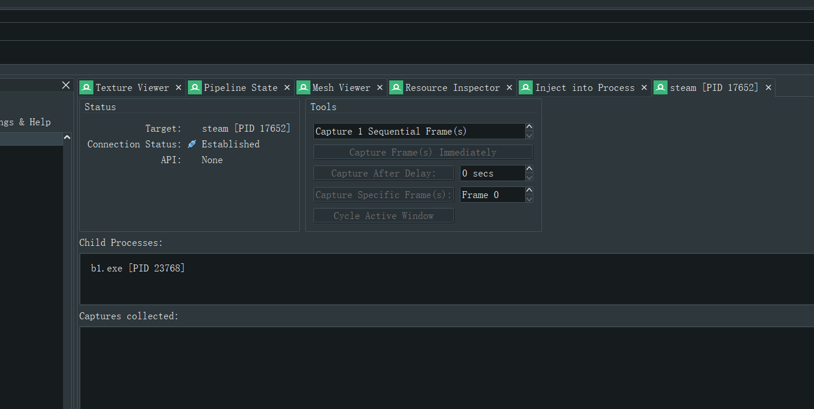
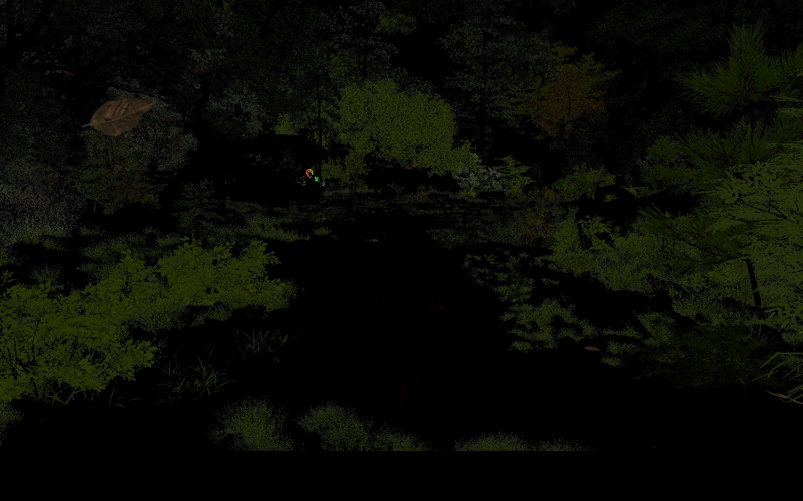

# Hacker 3

> NetID: guangy2
>
> Name: Guang Yin

## Task Description

**Hack GTAV or other DirectX programs with RenderDoc and get their internal G-buffer data and discuss any findings**

## Approach

> Note: There is not tutorial online that teach me how to use RenderDoc to hack games because of legal issues. So all steps below are explored and verified by me from scratch.

### Hook Injection

1. Open RenderDoc and go to the Settings -> General. Enable "Enable process injection", since we need to manually inject Steam and then let the game start as the child processes of Steam.

   > Note: Standard methods like global hooking and open Steam within RenderDoc's wrapped environment do not work because Steam has its own encryption for DRAM and will detect these standard ways of hacking.

   

2. Go to File -> Inject into Process

   

3. Enable "Capture Child Processes". Open Steam and quickly click Refresh many times until all Steam servies start. Then click Injection before the Steam calls any graphics APIs.

   > Note: There is no guarantee that this would work every time since the time window for injection is extremeley small.

   

4. Switch to Steam and force the game to open with DirectX 11 instead of DirectX 12 by adding extra launch parameters "-autoconfig dx11 / --use-d3d11".

   > Note: Ray tracing is not supported by RenderDoc. We can force the game not to use any ray tracing APIs by switching to DirectX 11.

   

5. Go back to RenderDoc. When the game starts, we will see its process as one of the child processes of Steam.

   

6. If RenderDoc capture UI shows in the top left corner of the game and the frame counter increases as time goes. Then the injection is successful. If the game doesn't start or the UI freezes in the first frame, please go back to previous steps and check if you miss anything.

   

7. In the game, play it as you normally do. If you want to capture the currect rendering frame and analysis it, press F12 or PrtScrn. Saving even one frame would take some time.

   

8. During capturing, you can see the Capture in Progress bar is moving. After the current capture, the saved frame will shown in Captures collected.

   

### G-buffer Exploration

9. Open the target frame and go to the Texture Viewer. On the left, we have all steps of rendering for this frame.

   > Note: Most of the time, there are thousands of steps and intermediate rendering results but only a few provide useful information. Since each game has its own rendering pipeline, there are no standard steps to follow to find what we want. The only suggestion is to better understand the rendering pipeline of the game engine before the G-buffer exploration. This would save a lot of time.

   > Note: Meshes can be viewed and extracted in the Mesh Viewer, but it will not be covered in this tutorial.

   

### Final Results:

> Note: RenderDoc provides [Python API](https://renderdoc.org/docs/python_api/index.html) so frame capturing process can be programed to generate the dataset we want in batch. However, the first G-buffer exploration still needs to be done manually.

