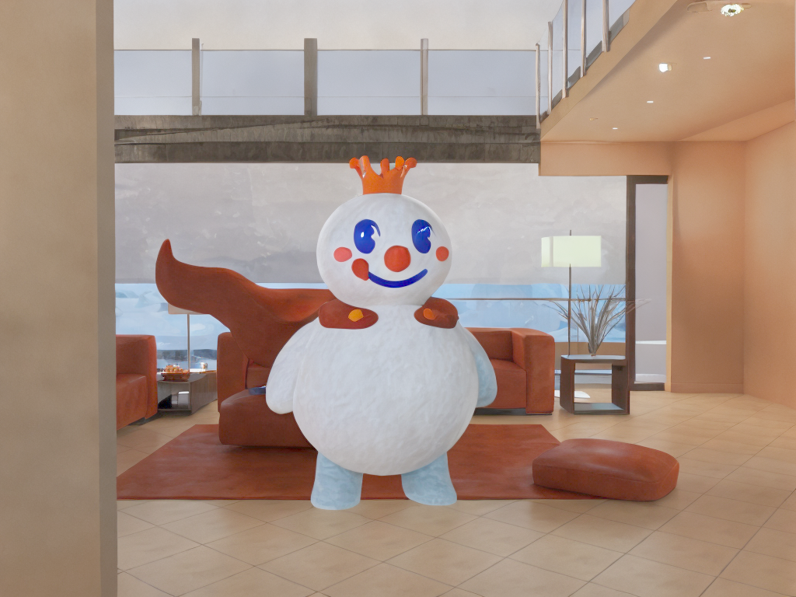
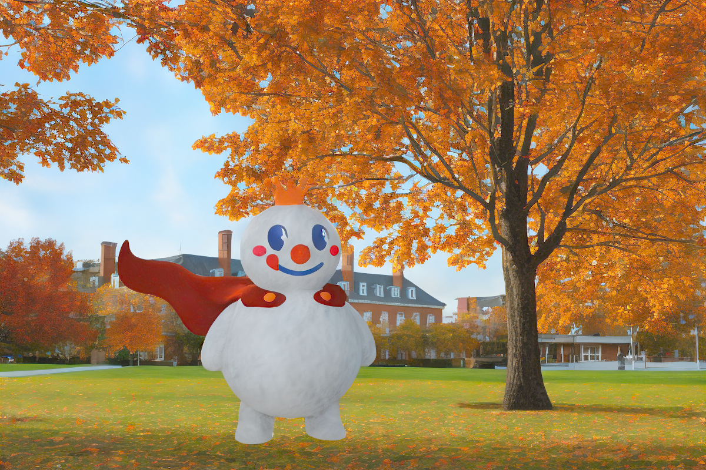

# Fun Scene Composition

**Hacker: Mei Han ([meih3@illinois.edu](mailto:meih3@illinois.edu))**

Place Snow King into indoor scenes from the Hypersim dataset and real photos.



## Pipeline

### Env

```
conda env create -n rgbx -f environment.yml
conda activate rgbx
```

### Preparation

- This project uses the indoor scene `ai_004__004/scene_cam00_final` from  [Hypersim](https://github.com/apple/ml-hypersim)  dataset as an example
- Remove background from Snow King using [Segment Anything](https://segment-anything.com/)

### Composition

```
python combine_images.py
```

### Generation

This section uses the [RGB↔X](https://github.com/zheng95z/rgbx) pre-trained model.

#### RGB→X

```
cd rgb2x
python gradio_demo_rgb2x.py
```

#### X→RGB

```
cd x2rgb
python gradio_demo_x2rgb.p
```



## Reference

```
@inproceedings{roberts2021hypersim,
  title={Hypersim: A photorealistic synthetic dataset for holistic indoor scene understanding},
  author={Roberts, Mike and Ramapuram, Jason and Ranjan, Anurag and Kumar, Atulit and Bautista, Miguel Angel and Paczan, Nathan and Webb, Russ and Susskind, Joshua M},
  booktitle={Proceedings of the IEEE/CVF international conference on computer vision},
  pages={10912--10922},
  year={2021}
}

@inproceedings{roberts2021hypersim,
  title={Hypersim: A photorealistic synthetic dataset for holistic indoor scene understanding},
  author={Roberts, Mike and Ramapuram, Jason and Ranjan, Anurag and Kumar, Atulit and Bautista, Miguel Angel and Paczan, Nathan and Webb, Russ and Susskind, Joshua M},
  booktitle={Proceedings of the IEEE/CVF international conference on computer vision},
  pages={10912--10922},
  year={2021}
}
```

