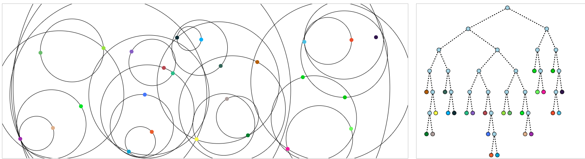
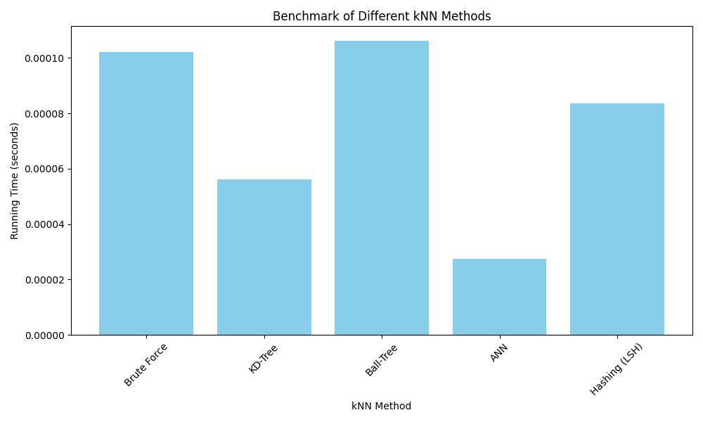
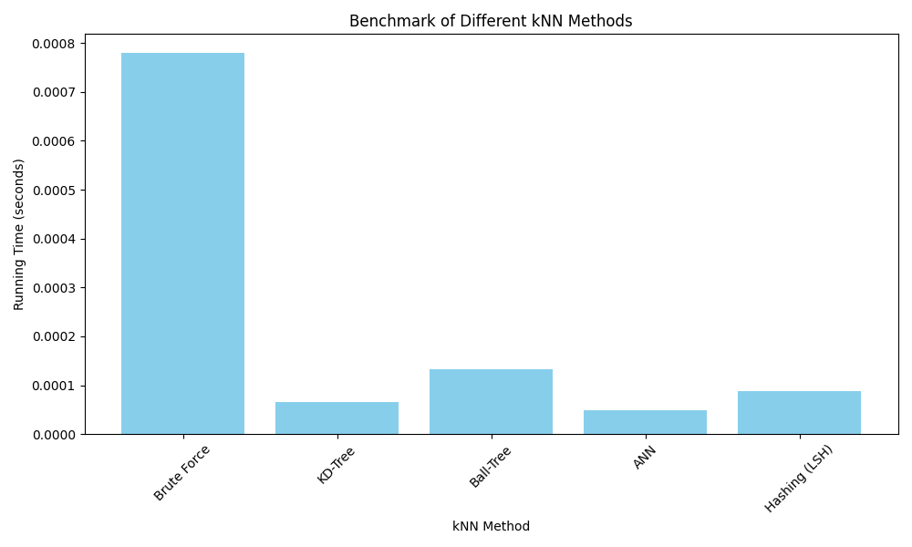
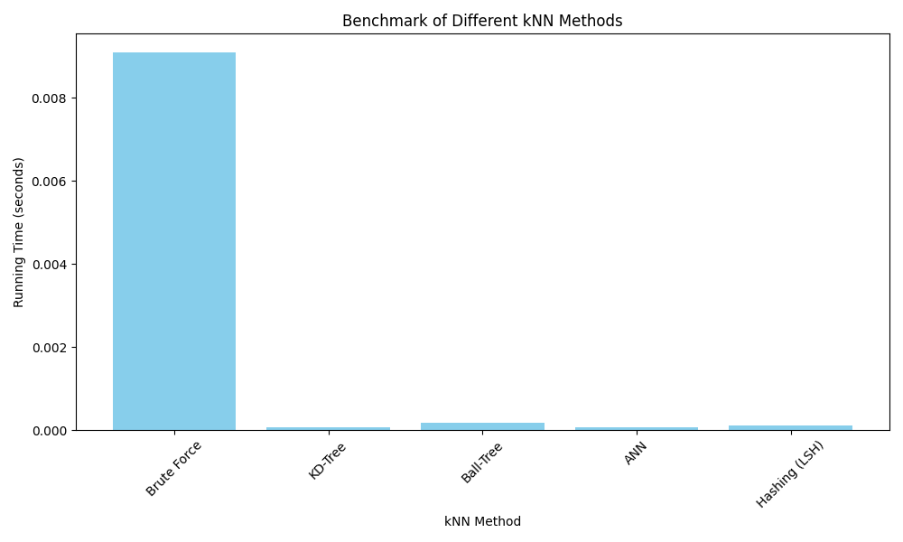
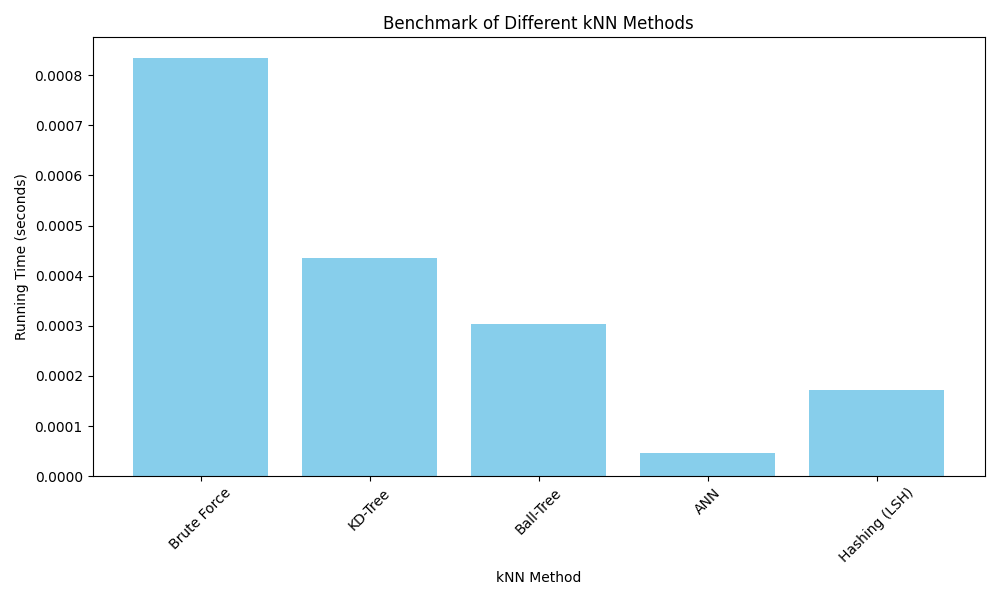
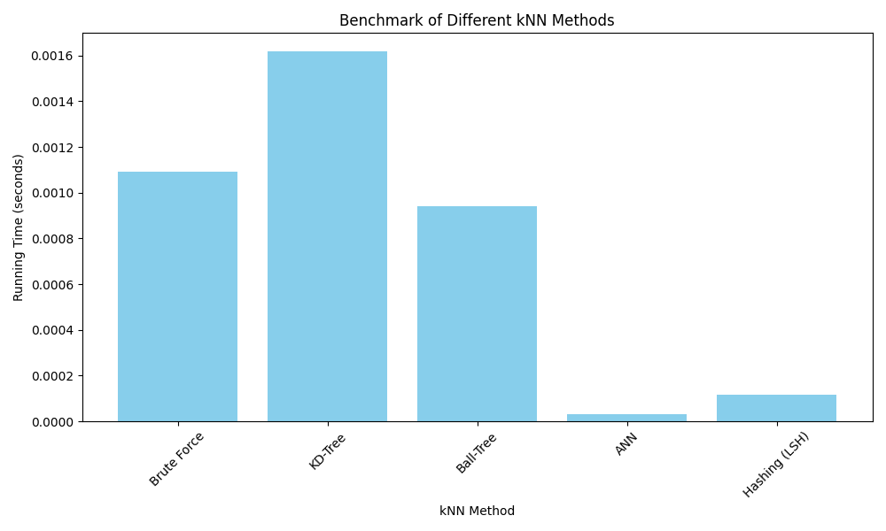
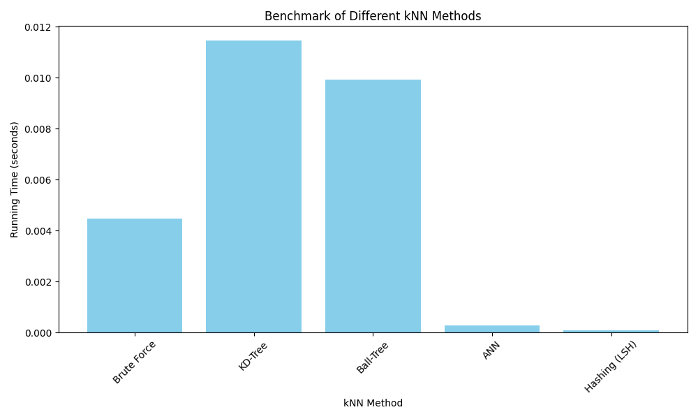
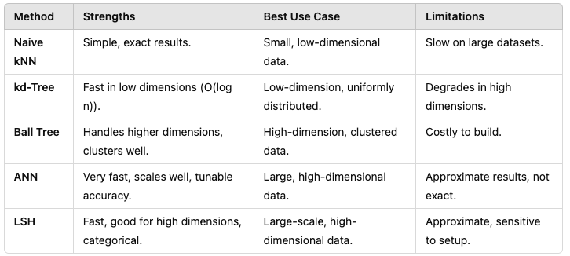

# Point Transformer Hacker 2

### Hacker: Shaowei Liu (shaowei3@illinois.edu)

## Interactive KNN demo

- Implement 2 Efficient tree structure: kd-tree and ball-tree to speed up KNN. Support interactively build and visualize the tree on web. 

- Usage: Download the repo and open `knn_demo/kd-tree/index.html` and `knn_demo/ball-tree/index.html` in your browser. Click in the left panel to insert 2D points and see the 2D space partion, right side shows the dynacmically built tree structure. Example screenshot shows below:

    

- We also host [live kd-tree demo](https://shaoweiliu.web.illinois.edu/cs598_knn_benchmark/kd-tree/) and [live ball-tree demo](https://shaoweiliu.web.illinois.edu/cs598_knn_benchmark/ball-tree/) here.


## KNN Benchmark

- We test 5 different KNN algorithms. The 5 algorithms are brute-force, kd-tree, ball-tree, ANN (annoy), and Hashing (LSH). 

    ```Shell
    pip install numpy scipy matplotlib scikit-learn rtree annoy datasketch
    cd knn_benchmark
    python benchmark.py
    ```

- Increase number of points

  | **N=1000** | **N=10000** | **N=100000** |
  |:---------------:|:--------------:|:----------------:|
  |  |  |  |


- Increase number of dimensions

  | **D=20** | **D=100** | **D=1000** |
  |:---------------:|:--------------:|:----------------:|
  |  |  |  |

- Conclusion:
Ball tree is more compact then KD-tree, especially helpful when the dimension is high. 

    
