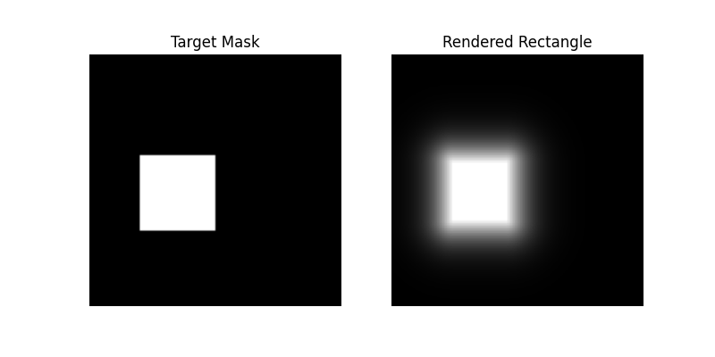

# Differentiable Rendering Hacker 2 (cconway4): 
## Minimal Implementation of Soft Rasterization for Rectangular Primitive

I implemented a soft backward function for rendering a rectangle primitive on an image. 
Simply run the jupyter notebook demo to save a gif animation of the rendering for a rectangle mask image in the same directory as the notebook.
The primitive uses a probabilistic forward map function just like the one for triangles in the paper (https://openaccess.thecvf.com/content_ICCV_2019/papers/Liu_Soft_Rasterizer_A_Differentiable_Renderer_for_Image-Based_3D_Reasoning_ICCV_2019_paper.pdf).
The function is used to compute backward gradient from pixel to primitive shape. 

I used Adam optimizer and cross entropy for loss but other loss functions may be considered. Sigma value for the probability function can also be altered. 

 

## Dependencies
I ran the notebook in Python 3.7 and implemented with pytorch. Additionally matplotlib and imagio were used for displaying outputs. 
