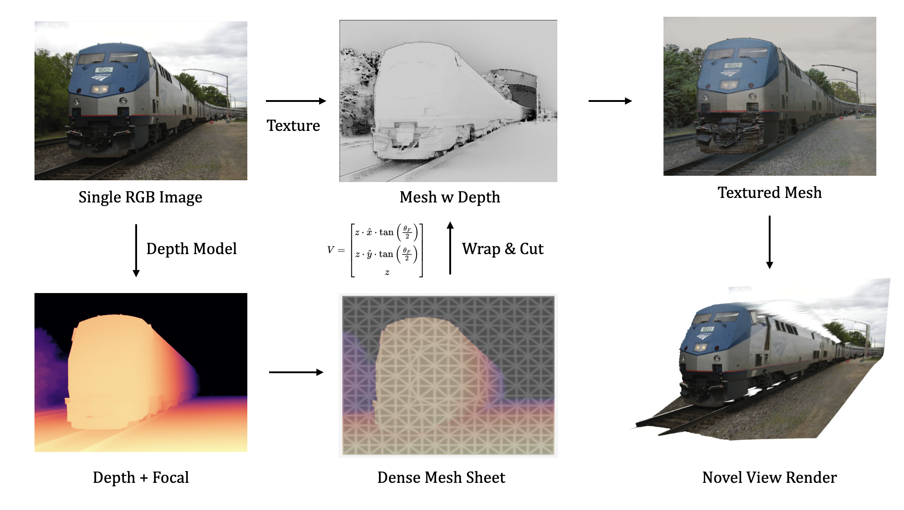

# Single Image Layout Hacker 2: Single Image Mesh Reconstruction


### Hacker: Ziyang8 (ziyang8@illinois.edu)

## Task
Thie repo is a modern version of paper [Automatic Photo Pop-up](https://dhoiem.cs.illinois.edu/publications/popup.pdf) leveraging the SOTA depth estimator. The input is a single image and the output is a colored mesh. The basic idea is to use a fully connected mesh sheet as prior with the image depth to generate a intial mesh and cut the discontinuous part based on the inv-depth gradient.

## Installation
```bash
# Create a new conda environment
conda create -n rgb2mesh python=3.10
conda activate rgb2mesh

# Install dependencies
pip install torch torchvision 
pip install -r requirements.txt

# Install pytorch3d
pip install "git+https://github.com/facebookresearch/pytorch3d.git"

# Install depth pro
pip install git+https://github.com/apple/ml-depth-pro.git
```

- Put depth pro model in `./checkpoints` folder
```
wget https://ml-site.cdn-apple.com/models/depth-pro/depth_pro.pt -P checkpoints
```
> I also provide a version for UniDepth, but the results are not as good as Depth Pro. Checkout `depth_model.,py` for more details.


## Usage
```
python main.py <IMAGE_PATH> --output_dir <OUTPUT_DIR>
```
The result will be saved in the `OUTPUT_DIR`. I provide several example images in the `./data` folder.

For visualization, you can try out the `render_spiral` or `render_orbit` function.


## Reference
- [Automatic Photo Pop-up](https://dhoiem.cs.illinois.edu/publications/popup.pdf)
- [World Sheet](https://worldsheet.github.io/)
- [Depth Pro](https://arxiv.org/abs/2410.02073)